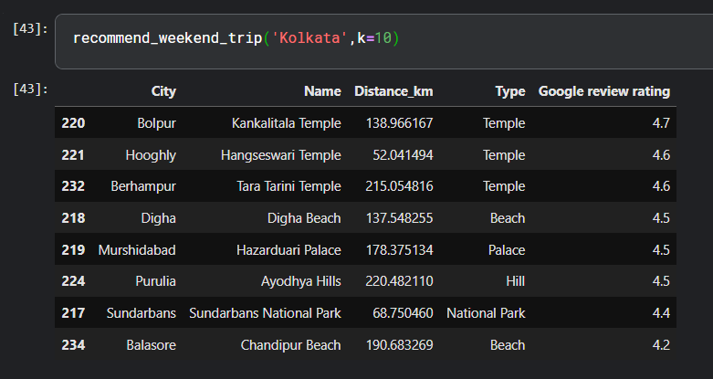
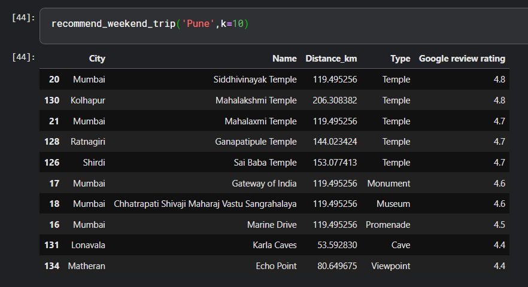

# Weekend Getaway Recommender System

## Overview
This project implements a **weekend travel destination recommender** that suggests nearby tourist destinations based on a user’s **source city**.

The system prioritizes:
- Short travel distance (weekend feasibility)
- High Google review ratings (destination quality)
- Interpretable, deterministic ranking logic

The solution is implemented using **Python and Pandas**, supported by an exploratory notebook and a production-ready script.

---

## Tech Stack
- Python
- Pandas
- NumPy

---

## Project Structure

```

.
├── outputs/
│   └── (generated recommendations)
├── README.md
├── final_data_with_coords.csv
├── recommender.py
├── requirements.txt
└── weekend-getaway-ranker.ipynb

````

---

## Dataset Description
The dataset (`final_data_with_coords.csv`) contains curated information about Indian tourist destinations.

### Key Columns
- `City` – Source city name  
- `Name` – Destination name  
- `Type` – Destination category (e.g., hill station, beach, heritage)  
- `Latitude`, `Longitude` – Geographical coordinates  
- `Google review rating` – Average user rating  

---

### Mathematical Formulation

#### 1. Distance Calculation (Haversine Formula)

To compute the geographical distance between a **source city** and a **destination**, we use the Haversine formula. It calculates the great-circle distance between two points on the Earth using their latitude and longitude.

$$\begin{aligned}
\Delta \phi &= \phi_2 - \phi_1 \\
\Delta \lambda &= \lambda_2 - \lambda_1 \\
a &= \sin^2\left(\frac{\Delta \phi}{2}\right) + \cos(\phi_1)\cos(\phi_2)\sin^2\left(\frac{\Delta \lambda}{2}\right) \\
c &= 2 \cdot \arctan2\left(\sqrt{a}, \sqrt{1-a}\right) \\
d &= R \cdot c
\end{aligned}$$

**Where:**
* : $\phi_1, \phi_2$: Latitudes (in radians)
* : $\lambda_1, \lambda_2$: Longitudes (in radians)
* : $R$: Earth’s radius ($6371 \text{ km}$)
* : $d$: Distance in kilometers

---

#### 2. Bayesian Popularity Score (Optional Extension)

Raw ratings can be misleading if a destination has very few reviews. A **Bayesian weighted popularity score** stabilizes the rankings by penalizing items with low review counts.

$$\text{Score} = \left( \frac{v}{v + m} \cdot R \right) + \left( \frac{m}{v + m} \cdot C \right)$$

**Where:**
* : $R$: Destination’s average Google review rating
* : $v$: Number of reviews for the destination
* : $C$: Mean rating across all destinations
* : $m$: Minimum reviews required to be listed (typically the median review count)

---

#### 3. Final Destination Ranking Score

Each destination is assigned a final ranking score that balances **quality** (rating) and **travel convenience** (proximity). We prioritize higher ratings but give a slight boost to closer locations.

**Where:**

* : The Google review rating ( to )
* : The calculated Haversine distance
* The term  prevents division by zero if the distance is negligible.

---

## Algorithm Summary
1. Load destination dataset  
2. Validate source city  
3. Compute distances using Haversine formula  
4. Filter destinations within 250 km  
5. Compute final ranking score  
6. Sort and return top-k recommendations  

---

## How to Run

### Install Dependencies
```bash
pip install -r requirements.txt
````

### Run the Recommender

```bash
python recommender.py
```

### Usage

The script runs in interactive mode:

```
Enter your current city (or 'q' to quit):
```

The top weekend destinations are printed to the console.

---

## Sample Output






---

## Notebook

`weekend-getaway-ranker.ipynb` contains:

* Data exploration
* Distance analysis
* Feature reasoning
* Ranking experiments

The final logic is distilled into `recommender.py`.

---

## Why This Approach Works

* Simple and interpretable scoring
* No black-box models
* Easy to justify mathematically
* Suitable for small to medium datasets
